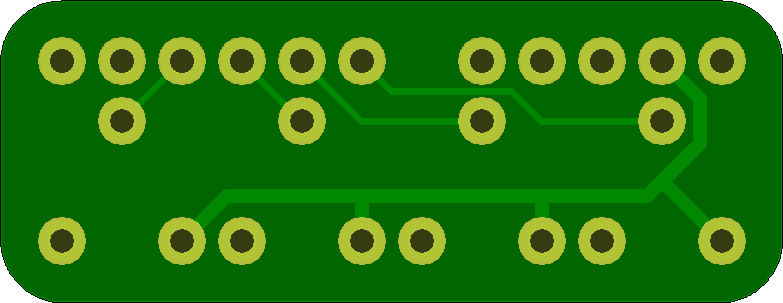

## For Arduino 

I created this board to act as a mini shield to provide an easy way to have four analog adjustments on the Arduino with A0 through A3

It uses a common and inexpensive trim-pot form factor, but makes it much easier to connect them to the arduino. 

## PotBreakout 

### Board dimensions

* (130000, 50000) original units
* (1.3000, 0.5000) inches
* (33.0200, 12.7000) mm

| Front | Back |
| --- | --- |
|  |  |

